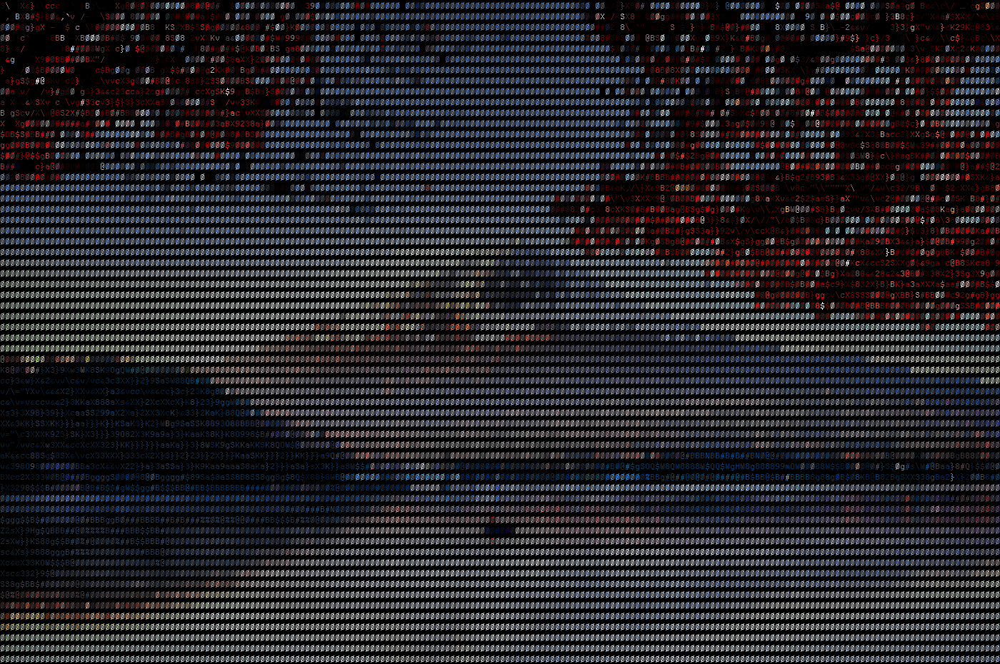
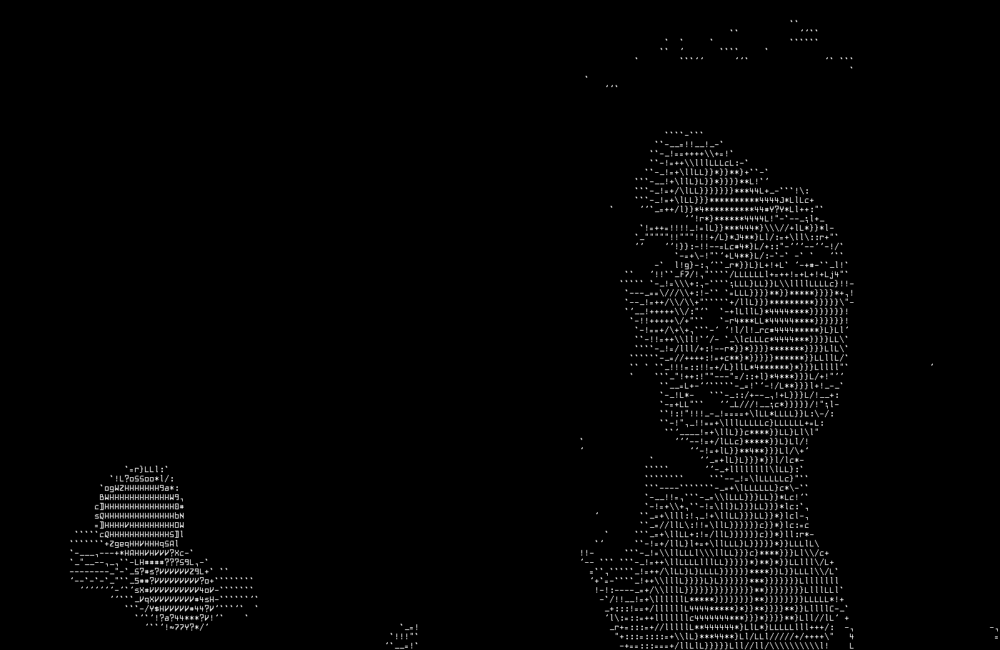

# ascii-image
Converts images and gifs to ASCII art.






## Installation:
### From source:
You will need to install [Rust](https://www.rust-lang.org/learn/get-started) in order to install this program from source. 
After installing Rust, installation is simply:
```
cargo install image-to-ascii
```
### Pre-compiled binary:
You can download the appropriate pre-compiled binary from the Releases section on GitHub. Currently, binaries are built for the latest versions of Ubuntu, Windows, and MacOS.

## Usage
Here are some examples of converting between various input and output formats:
```
image-to-ascii input_image.jpg
image-to-ascii input_image.gif -o output_image.gif
image-to-ascii input_image.jpeg -o output_image.png --width 200
image-to-ascii input_image.gif -o output_image.gif --metric dot --font bitocra-13 --alphabet minimal
image-to-ascii input_image.gif -o output_image.json --metric grad --font fonts/courier.bdf --alphabet alphabets/letters.txt --conversion-algorithm base
```

### Input
All image formats readable by [image](https://docs.rs/image/latest/image/) should be supported as inputs and are detected automatically from the input file name.
Animated .gif files can also be used as inputs; if the output format is .gif or .json, the output will be animated as well.

### Output
All image formats writable by [image](https://docs.rs/image/latest/image/) should be supported as outputs and are detected automatically from the output file name.
If the output format is .json and the input format is an animated gif, you can preview the animated result by opening it with viewer.html.
If no output file is provided, the output will be displayed directly in the terminal; note that most terminals are not designed to keep up with the rate that this program outputs text, so the terminal output can be quite choppy. 

### Fonts
This program works with monospace bitmap fonts in .bdf format. 
If you would like to use a font other than the default, you can find a large collection of free bitmap fonts [here.](https://github.com/Tecate/bitmap-fonts)

## Arguments
### <IMAGE_PATH>
Path to the input image file. If the input file is an image, the output will be a static image. If the input is a .gif, then the output will be animated. Has been tested to work with .gif, .png, .jpg, .bmp, .svg, and .json file formats.

### -a, --alphabet <ALPHABET>            [default: alphabet]
Name or path specifying an alphabet to use. The provided font must have a glyph for each character in the provided alphabet. Valid alphabet names are:
- [alphabet](alphabets/alphabet.txt)
- [letters](alphabets/letters.txt)
- [lowercase](alphabets/lowercase.txt)
- [uppercase](alphabets/uppercase.txt)
- [minimal](alphabets/minimal.txt)
- [symbols](alphabets/symbols.txt)
- [fast](alphabets/fast.txt) (this should only be used for color output)

### -b, --brightness-offset <BRIGHTNESS_OFFSET>    [default: 0, min: 0, max: 255]
Amount subtracted from each grayscale pixel of the image before computing character similarities. In most cases, a brightness offset of 0 is typically appropriate. For black and white output with some metrics (dot, jaccard, occlusion, and clear) lighter images tend to look better with a high brightness offset.

### -f, --font \<FONT>                    [default: bitocra-13]
Name or path specifying a font to use. The provided font must be monospace in .bdf format and have a glyph for each character in the provided alphabet. Valid font names are:
- [courier](fonts/courier.bdf)
- [bitocra-13](fonts/bitocra-13.bdf)

### --fps <FPS>                                [default: 30]
Frames per second for the gif or terminal output. For gif output, the max fps is 30.

### -h, --help                                     Print help information

### -m, --metric <METRIC>                          [default: fast]
The metric used to determine which character best matches a particular chunk of an image. Valid values are:
- intensity:               how close the chunk's brightness is to the brightness of the character bitmap
- fast                     synonym for intensity
- dot:                     dot product between chunk pixel values and character bitmap values
- jaccard:                 weighted jaccard index between chunk pixel values and character bitmap values
- occlusion:               how much the chunk is "occluded" by the character bitmap, or vice versa
- clear:                   how much the font "clears" from the chunk when subtracted from it
- direction-and-intensity: how similar the direction and intensity of the chunk are to those of the bitmap values for a character
- grad:                    synonym for direction-and-intensity
- direction:               how similar the direction of the chunk pixels is to the overall direction of the character bitmap

### --no-color
Causes the output to be black and white. Intended for environments that don't support colored output, e.g., some terminals, some editors or text environments, etc. 

### --conversion-algorithm <CONVERSION_ALGORITHM>  [default: two-pass]
The algorithm which is used to convert pixels into characters. Valid values are:
- base:           convert the pixels using the provided metric only
- edge:           perform edge detection, then convert the detected image edges using the direction metric
- edge-augmented: combine the original image with an edge detection layer, then apply the provided metric to the augmented image
- two-pass:       convert the detected image edges using the direction metric, then convert any non-edge pixels using the provided metric

### -o, --out-path <OUT_PATH>
Path to write the output to. If no value is provided, output will be displayed in the console. Has been tested to work with .gif, .png, .jpg, .bmp, .svg, and .json file formats. Any gif viewer can display .gif output, and viewer.html can be used to display .json gif output.

### -t, --threads <THREADS>                        [default: 1]
Number of threads to use when converting pixel chunks to characters. Higher values can reduce conversion time.

### -w, --width <WIDTH>                            [default: 150]
The width in characters of the final output. Will preserve the aspect ratio as much as possible while having the output width and height be a multiple of the font width and height.
