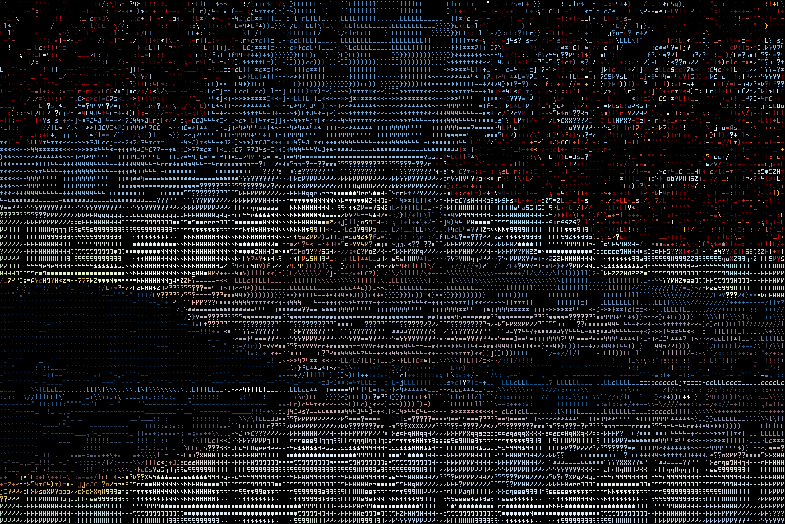

# ascii-image
Converts images and gifs to ASCII art.




## Usage
Here are some examples of converting between various input and output formats:
```
cargo run --release -- input_image.jpg
cargo run --release -- input_image.gif -o output_image.gif
cargo run --release -- input_image.jpeg -o output_image.json
cargo run --release -- input_image.gif -o output_image.gif --metric dot --font-path bitocra-13.bdf --width 200
```

All image formats readable by [image](https://docs.rs/image/latest/image/) should be supported as inputs and are detected automatically from the input file name.

This program can output gifs or JSON, depending on the provided output file name.
If the output format is .json and the input format is an animated gif, you can preview the animated result by opening it with viewer.html.
If no output file is provided, the output will be displayed directly in the terminal; note that most terminals are not designed to keep up with the rate that this program outputs text, so the terminal output can be quite choppy. 

This program only works with monospace bitmap fonts in .bdf format. 
If you would like to use a font other than the default, you can find a large collection of free bitmap fonts [here.](https://github.com/Tecate/bitmap-fonts)

## Arguments
### <IMAGE_PATH>
Path to the input image file. If the input file is an image, the output will be a static image. If the input is a .gif, then the output will be animated.

### -a, --alphabet-path <ALPHABET_PATH>            [default: alphabets/alphabet.txt]
Path to the file containing the alphabet to use. The provided font must have a glyph for each character in the provided alphabet.

### -b, --brightness-offset <BRIGHTNESS_OFFSET>    [default: 128, min: 0, max: 255]
Amount subtracted from each grayscale pixel of the image before computing character similarities. Darker images tend to look better with low brightness offsets, while lighter images tend to look better with high ones.

### -f, --font-path <FONT_PATH>                    [default: fonts/kourier.bdf]
Path to the file containing the font to use. The provided font must be monospace in .bdf format and have a glyph for each character in the provided alphabet.

### --fps <FPS>                                [default: 30]
Frames per second for the gif or terminal output. For gif output, the max fps is 30.

### -h, --help                                     Print help information

### -m, --metric <METRIC>                          [default: grad]
The metric used to determine which character best matches a particular chunk of an image. Valid values are:
- grad:      how similar the gradient and intensity of the pixel values are to those of the bitmap values for a character
- fast:      how close the brightness of the pixel values is to the brightness of the character bitmap
- dot:       dot product between pixel values and character bitmap values
- jaccard:   weighted jaccard index between pixel values and character bitmap values
- occlusion: how much the pixel values are "occluded" by the character bitmap, or vice versa
- clear:     how much the font "clears" from the pixel when subtracted from it

### -n, --noise-scale <NOISE_SCALE>                [default: 0]
Adds noise to the value of the metric for each character. Can either be used to diversify characters in output by "breaking ties" or add a glitch effect, depending on the amount of noise used.

### -o, --out-path <OUT_PATH>
Path to write the output to. If no value is provided, output will be displayed in the console. Supports outputting to .json or .gif. Any gif viewer can display .gif output, and viewer.html can be used to display .json gif output.

### -t, --threads <THREADS>                        [default: 1]
Number of threads to use when converting pixel chunks to characters. Higher values can reduce conversion time.

### -w, --width <WIDTH>                            [default: 150]
The width in characters of the final output. Will preserve the aspect ratio as much as possible while having the output width and height be a multiple of the font width and height.